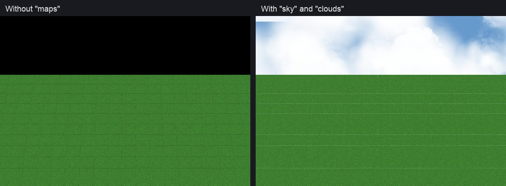

# Custom maps

A map that is in nobody's GRF: its ground, its monsters, its NPCs and the sky
behind it, all from a mod folder. This page is everything a custom map needs,
in the order you will need it. [Making mods](../MODDING.md) is the reference for
the rest of the mod format.

The worked example is [`examples/mods/custom-map`](../../examples/mods/custom-map),
a small island called `ro_isle`, and
[`examples/mods/island-ferry`](../../examples/mods/island-ferry) is a boat to it
from Alberta. As a GM, `@warp ro_isle 40 40` takes you there.

## What goes in the mod

```
my-mod/
  mod.json                    "maps": the sky, weather and music, below
  data/
    my_isle.gat               where you can walk
    my_isle.gnd               the ground mesh and its textures
    my_isle.rsw               the models, lights, water and sounds
    texture/my_isle/...       the ground's textures
    texture/À¯ÀúÀÎÅÍÆäÀ̽º/map/my_isle.bmp   the minimap
  BGM/
    my_isle.mp3               its music, if it has its own
  npc/
    my_isle.txt               monsters, warps and NPCs on it
```

The three geometry files are what the client draws and what the server walks
on. The `npc/` script is ordinary rAthena script: `monster` lines for what
spawns, `warp` lines for the way in and out.

## The server side: nothing to configure

**This works end to end**, and there is nothing to set up: put the geometry in
`data/` and the server side is done.

That is worth stating plainly because it is not how rAthena works on its own. A
custom map needs **three** things on the server, two of which are invisible:

1. **A `map:` line in the map config.** The map server builds its list of maps
   from `map:` directives — `conf/maps_athena.conf` is twelve hundred of them.
   A map never named there is not in the list and the server says *nothing at
   all* about it. This is the one that wastes the afternoon.
2. **An entry in `db/import/map_index.txt`**, which gives the map the number
   the servers pass between them. Missing, and the map is dropped at load with
   only a "maps removed" count to say so.
3. **An entry in `db/import/map_cache.dat`.** rAthena's map server never reads
   a `.gat` at runtime; it reads a prebuilt cache and refuses any map not in
   one, however correctly it is registered elsewhere. Upstream builds this file
   with a separate `mapcache` tool that links against the whole server and
   reads geometry out of a GRF.

On every start, the supervisor scans each enabled mod's `data/` for `.gat`
files, decodes them, writes `map_cache.dat` and `map_index.txt` into the
`db/import` tree it mounts, and adds the `map:` lines to the generated
`map_conf.txt` (`stack/src/mapcache.rs`, `stack/src/mods.rs`). It prints what
it found:

```
mods: custom-map
mod maps: ro_isle
```

The map cache is built in-process rather than by running rAthena's `mapcache`
tool, so a custom map needs no Docker rebuild and no image change — which is
the same promise as the rest of the mod system.
[Modding internals](../MODDING_INTERNALS.md#custom-maps-settled-and-how) has
how each of the three was found.

## Making the geometry

**Settings → Tools → [Map editor](MAP_EDITOR.md)** is the easy way: it makes
the ground, its textures, walkability, water and light, places models, NPCs,
warps and monsters, writes everything below into a mod for you, and takes you
there with Test in game. An official map can be the starting point.

For a script, or with no app at hand:

```
scripts/mkmap.py my_isle --out path/to/my-mod/data --cells 40
```

writes a flat, walled, walkable square with a generated ground texture and a
minimap: `.gat`, `.gnd`, `.rsw`, `data/texture/my_isle/ground.bmp` and
`data/texture/À¯ÀúÀÎÅÍÆäÀ̽º/map/my_isle.bmp`. It is a floor to stand on, not a
landscape — for real terrain use the map editor, or one of the community map
editors and copy its `.gat`/`.gnd`/`.rsw` into `data/` exactly the same way.

The traps:

- **Map names are at most 11 characters.** rAthena truncates silently at three
  separate layers before anything complains. The app names a longer one in the
  log and leaves it out.
- **The `.gnd` is half the `.gat`'s resolution.** An 80 × 80 walkable map is a
  40 × 40 ground mesh.
- **A `.gnd` lightmap cell is not a brightness value.** It is 64 bytes of
  shadow followed by 64 RGB triples of *additive* coloured light. Filling the
  cell with `0xff` — the obvious thing — adds full white light to every pixel
  and renders the map as a flat white sheet with the texture washed out of it.
- **Without a minimap bitmap** at `data/texture/À¯ÀúÀÎÅÍÆäÀ̽º/map/<name>.bmp`
  the client asks once, gets a 404, and shows an empty frame. A mod can write
  that folder name in ASCII instead; see
  [data/](../MODDING.md#you-can-write-ascii-instead-of-mojibake).

## The sky, the weather and the music

Behind the map, where there is no ground, the client draws either a sky or
black. **A custom map is black unless its mod gives it a sky**, and it plays the
client's default track (`01.mp3`) unless its mod gives it music.

The client does not take this from the map's files. Official clients keep a
list of the maps that have a sky inside the game executable, and roBrowser
keeps the same list in `src/DB/Effects/WeatherEffect.js`: about a dozen official
maps (Juno, Valkyrie, the airships, Himinn and a few others) get a blue sky
with white clouds drifting across it, and every map not on the list is cleared
to black. So a floating island, a temple in the clouds or anything else with
open edges needs one line in its `mod.json`.

The music is the same story from the other side. Which track plays on which
map is `data/mp3nametable.txt`, one table for the whole game: a mod could only
name its map's music by shipping a copy of the table, which replaced every
other map's music with whatever that copy said, and two such mods undid each
other. The same line does it instead:

```json
{
  "name": "my-mod",
  "maps": {
    "my_isle": { "sky": [0.4, 0.6, 0.8], "clouds": [1.0, 1.0, 1.0], "bgm": "my_isle.mp3" }
  }
}
```



*The edge of [`custom-map`](../../examples/mods/custom-map)'s island, `ro_isle`,
with no `"maps"` entry and with `"sky": [0.4, 0.6, 0.8], "clouds": [1.0, 1.0, 1.0]`.*

Each key is a map name, as in `@warp` (a trailing `.rsw` is allowed and
ignored). Each map takes any of four settings:

| Setting | What it is | Example |
|---|---|---|
| `sky` | The colour behind the map: red, green, blue, each from 0 to 1, and optionally a fourth for alpha (1 when left out). | `[0.4, 0.6, 0.8]`, the sky over Juno |
| `clouds` | The colour of the clouds that drift across the sky, red, green and blue from 0 to 1. Leave it out for a plain colour with no clouds. Needs a `sky`. | `[1.0, 1.0, 1.0]`, white |
| `weather` | A screen effect while on the map: `"snow"`, `"rain"`, `"fireworks"`, `"leaves"`, `"sakura"`, or `"cloud"` to `"cloud8"` (low clouds over the screen, as in Einbroch). | `"snow"` |
| `bgm` | The music, a file name in `BGM/`: one the mod ships in its own `BGM/` folder, or one of the client's tracks. Letters, digits, `_` and `-`, ending in `.mp3`. | `"my_isle.mp3"`, or `"08.mp3"` for Prontera's theme |

Some combinations from the official maps, to start from:

| Look | Setting |
|---|---|
| Blue sky, white clouds (Juno, Valkyrie, airships) | `"sky": [0.4, 0.6, 0.8], "clouds": [1.0, 1.0, 1.0]` |
| Dusk over Thanatos | `"sky": [0.88, 0.83, 0.76], "clouds": [0.37, 0.0, 0.0]` |
| Endless Tower's purple | `"sky": [0.2, 0.0, 0.2], "clouds": [1.0, 0.7, 0.7]` |
| A dark void, no clouds | `"sky": [0.02, 0.02, 0.06]` |

A few things worth knowing:

- **It is any map, not only your own.** A mod may give Prontera a sky or Payon
  rain. When two mods set the same map, the one applied later wins, as with
  `db/` tables (`"after"` decides the order).
- **A mistake is refused, by name.** A colour with a value above 1, clouds with
  no sky, a weather the client does not know, a music file in a folder, a key
  other than these four: the
  mod is not loaded, and Settings → Mods says which map and which setting. That
  is deliberate. A typo that quietly drew black would look like the feature not
  working.
- **It is read when the game loads.** Switch the mod on and press Apply, and
  Settings offers to reopen the game; the sky is there from then on. An edit
  to an installed mod's `mod.json` is picked up the next time the app starts
  the server, or when the mod is switched off and on again.
- **A track the client cannot find does not play**, and the default does not
  play in its place; `state/assets/logs/missing-files.log` names the file. Ship
  it in the mod's `BGM/`, or check the name against the client's `BGM/` folder.
- **It needs Ragnarok Offline 1.5.1 or later.** An older app ignores `"maps"`,
  so the mod still loads there, with a black sky and the default track. Put `"requires": { "app":
  ">=1.5.1" }` in the mod when the sky matters to it.

How it works: the app collects every enabled mod's `"maps"` into a
`customMaps` entry in the client's generated config (`Config.local.js`,
`stack/src/assets/client_tables.rs`). Our roBrowser fork reads it each time a
map loads (`src/DB/Map/CustomMaps.js`): the sky and weather go over its
built-in weather table, and the music ahead of `mp3nametable.txt`'s entry. A map
with no entry is drawn and played exactly as before.

## Getting there

A map nobody can reach is not much use. The usual ways in:

- **A warp or an NPC** in an existing town, from your mod's `npc/` script:
  `alberta,190,140,0	warp	ToMyIsle	1,1,my_isle,40,40` for a portal, or an
  NPC that asks first and then calls `warp "my_isle",40,40;`. The
  [island-ferry](../../examples/mods/island-ferry) example is the second kind.
- **As a GM:** `@warp my_isle 40 40`.
- **As where new characters start:** `start_point` in the mod's
  `conf/char_conf.txt`; see
  [`examples/mods/start-in-your-town`](../../examples/mods/start-in-your-town).
- **The AI characters** can live there too:
  [Where the AI characters go](ai-characters.md) and
  [`examples/mods/island-population`](../../examples/mods/island-population).

## When it does not work

| What you see | Look at |
|---|---|
| `@warp` says the map is not found | the startup log: no `mod maps: my_isle` line means the `.gat` is not in the mod's `data/`, or the name is longer than 11 characters |
| The map loads as nothing, or the client hangs on the loading screen | `state/assets/logs/missing-files.log`: a `.gnd`, `.rsw` or texture the client asked for and the mod does not ship |
| The ground is a flat white sheet | the `.gnd` lightmap; see the traps above |
| The minimap is an empty frame | the minimap bitmap's path |
| Black behind the map | `"maps"` in `mod.json`, above |
| The wrong music, or none | `"maps"`.`bgm` in `mod.json`, and `missing-files.log` for a track that is not there |
| A change to the map does nothing | the client's own file cache: [The client caches, hard](../MODDING.md#the-client-caches-hard) |
