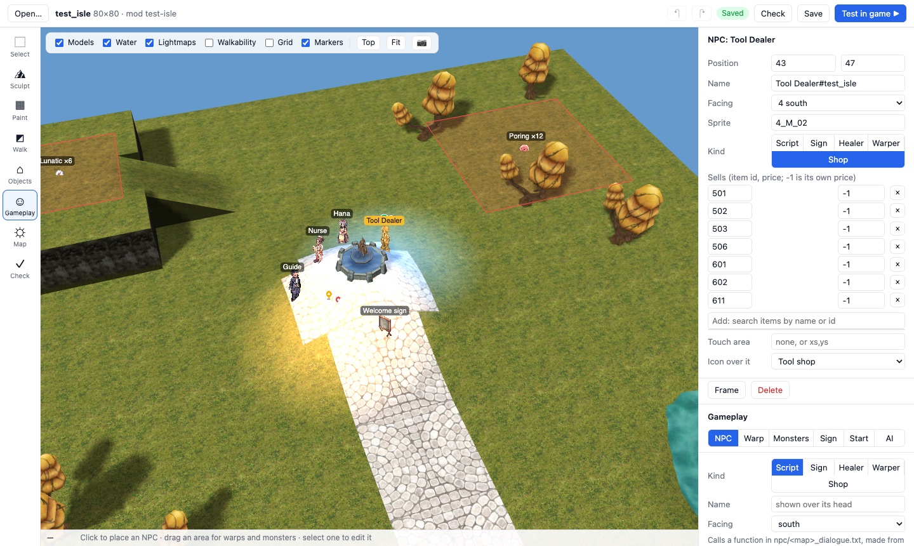

# The map editor

**Settings → Tools → Map editor** makes a map, or changes one of your client's,
and saves it as a mod: the ground and its textures, walkability, water and
light, the models on it, its NPCs, warps and monsters, and its sky, weather
and music. **Test in game** switches the mod on, restarts the server and puts
your character there.

It runs wherever the app runs — macOS, Windows, Linux and the Steam Deck — and
works on your own client's files: the models, textures and sounds you browse
and place are the ones in your GRFs, referred to by path, never copied into
the mod. An AI agent can use it too, through a command line and MCP tools
([below](#for-ai-agents-and-scripts)).



[Custom maps](CUSTOM_MAPS.md) explains what a map mod is made of and how the
server side is done for you; this page is the tool that makes one.

## Starting

Open the editor from **Settings → Tools → Map editor**. It reads your client
through the game's asset server, so start the game once first (press Play).

- **New map**: a name (what `@warp` and scripts call it: at most 11
  characters, lowercase letters, digits, `_` and `-`), the mod to keep it in,
  a size in cells and a ground texture.
- **Open a map → My mods**: a map in one of your mods.
- **Open a map → Maps in my client**: any map in your GRFs. Give it a new name
  to make it your own map; the original is left alone. Without a new name you
  are editing the original itself — an *override*, which changes it for
  everyone with the mod switched on (the editor asks before saving one).

## Moving around

| | |
|---|---|
| Right drag | turn the camera |
| Shift + right drag, middle drag | pan |
| Wheel | zoom (toward the cursor) |
| W A S D, arrow keys | pan (arrows move the selection when there is one) |
| Q / E | turn |
| T, **Top** | look straight down |
| Home, **Fit** | the whole map |
| F | frame the selection |

The layer switches over the view show or hide models, water, the baked
lighting, the walkability overlay, a cell grid and the markers (NPCs, warps,
monsters, lights, sounds and effects). The status bar names the cell under the
cursor, its height and whether it can be walked on.

## The tools

The numbers are their keys.

### 1 Select

Click a model, NPC, warp or monster spawn to select it; Shift adds to the
selection; drag on empty ground to select everything in a box. Drag a
selection to move it (snapped to whole cells unless you hold Alt or untick
*Snap to cells*). The inspector on the right edits the selection:

- **A model**: position, height (or *On ground*), turn, full rotation, scale.
- **Several objects**: line them up on x, y or height, spread them evenly,
  turn them together, duplicate, copy, or **save them as a prefab** — a group
  (a house with its fence and lamps) you can stamp on any map.
- **A light, sound or effect**: its colour and range, volume and repeat, or
  which effect.

`Delete` removes the selection, `Ctrl+D` duplicates it, `[` and `]` turn it
15° (90° with Shift). **Copy and paste work between maps**: select a building
and its surroundings on an official map, `Ctrl+C`, open your map, and
`Ctrl+V` pastes it under the cursor.

### 2 Sculpt

- **Brush**: raise, lower, smooth, flatten, set to a height, or roughen, with
  a size, a strength (cells a second while you hold the button) and a soft or
  hard edge. Shift does the opposite, Ctrl smooths, Alt+click picks up the
  height under the cursor.
- **Area**: drag a rectangle and make it a plateau (hard edges: a cliff), raise
  or lower it, ramp it from one height to another, or smooth it.
- **Walls**: where neighbouring ground meets at different heights there has to
  be a face, or there is a gap. Area makes them for you; this redoes them
  everywhere, with a texture of your choice.
- **One corner**: set one corner of one ground cube, for the sharp edges RO
  maps use.

**Walkability follows the ground.** Steep slopes, cliff edges and missing
ground become blocked, walkable ground under the water line becomes walkable
water — the same rule the server applies. rAthena's path search ignores
heights entirely, which is why a cliff a player could walk off has to be
blocked.

### 3 Paint

The palette is the map's own ground textures; **Add a texture from your
client** browses every texture in your GRFs, with thumbnails. Paint with a
brush or a rectangle, on the ground, the walls or both, turned and mirrored,
and with one copy of the texture laid over 1, 2, 4 or 8 cubes (official maps
mostly use 4). Alt+click picks up the texture under the cursor; R turns it.
**Tint** multiplies the ground by a colour: darker paths, warmer sand.

### 4 Walkability

Paint what the server lets players walk on: walkable, blocked, walkable water,
or cliff (you can shoot and cast over it but not walk on it). Cells you paint
keep their type when the ground under them changes. *Work it out again*
rebuilds walkability from the ground, keeping what you painted (or not, if you
say so).

### 5 Objects

- **Models**: search every model in your client by name or folder (folder
  names are Korean; the common ones are offered in English), with rendered
  thumbnails and your recently used ones. Click the map to place; Alt+click a
  model on the map to place more of it.
- **Lights**: point lights with a colour and a range. They colour the ground
  when the lightmaps are baked.
- **Sounds**: ambient loops from `data/wav/`, listened to before placing.
- **Effects**: the emitters official maps use — torches, fireflies, smoke,
  bubbles, glows, waterfalls.
- **Prefabs** and **Paste**: what you saved or copied, from any map.

### 6 Gameplay

The NPCs, warps and monsters on the map. Each is a marker you place by clicking
(or dragging an area) and edit in the inspector.

- **NPC**: a sprite from the client's NPC sprites (searchable, with previews),
  a name, which way it faces, and what it is:
  - **Script**: talking to it runs a function *you* write (see
    [NPC behaviour](#npc-behaviour-placement-here-logic-in-a-file)).
  - **Sign**: says a few lines and closes.
  - **Healer**: heals fully.
  - **Warper**: a menu of places, and a warp to each.
  - **Shop**: sells items you pick from the server's item table, at their own
    price or yours.

  An NPC can have an icon over it (the Kafra's backpack, the tool dealer's
  potion) and an OnTouch area.
- **Warp**: drag the portal's area, then choose where it lands — type it, or
  **Pick…** and click a cell on the destination map, drawn from above with its
  walkability. *Make the last warp two-way* adds the way back on the other map,
  beside where yours lands (a return warp on the arrival cell would bounce
  players straight back).
- **Monsters**: drag the area they wander in, pick the monster from the
  server's monster table (with its sprite), how many and how fast they come
  back. Or anywhere on the map. The inspector shows the density.
- **Sign**: an icon or a captioned board over any cell.
- **Start**: where Test in game puts your character.
- **AI**: let the population engine's characters (Settings → Fake players) live
  here too, as a town, field or dungeon.

The list under the tools is everything on the map; click one to go to it.

### 7 Map

Name and display name, size (resize keeps everything where it is; crop is a
command), **sky and clouds** with presets from official maps, **weather**,
**music** (every track in your client, which official maps play it, and a play
button — see [The music browser](#the-music-browser)), **water** (level, look,
waves), **sunlight** (direction, height, colours and shadow strength, previewed
as you drag) and **lightmaps**.

**Bake** works out the shadows that models and hills cast and the colour from
point lights, and writes them into the ground's lightmaps, as the official
tools do. *Soft shadows* takes four rays a texel. *Reset to plain* removes all
baked lighting. Baked lightmaps are what make a map look like an RO map; a
hand-filled one is the classic way to get a white map, and the editor never
writes one.

The **minimap** is the map rendered from straight above, generated every time
you save and written where the client looks for it, so a new map never shows an
empty frame.

### 8 Check

What would stop the map loading, or make it play badly:

- the name is too long or has characters rAthena drops;
- a ground texture, model or sound the client would ask for and not find;
- a warp that lands on a blocked cell, inside another warp, or off a map —
  including on the other map, which it reads to check;
- walkable ground nobody can reach from where players arrive, and NPCs nobody
  can walk up to;
- a monster the server does not have, a spawn area with nowhere to stand;
- two NPCs with the same name, or a name longer than rAthena's 24 characters;
- lightmaps that would draw a white sheet;
- nothing leading to the map yet.

Click a problem to go to it. Test in game refuses to start while there are
problems.

## Saving: what goes in the mod

**Save** (`Ctrl+S`) writes into `mods/<mod>/`:

| File | What it is |
|---|---|
| `data/<map>.gat`, `.gnd`, `.rsw` | walkability, the ground, the world on it |
| `data/texture/ui/map/<map>.bmp` | the minimap |
| `npc/<map>.txt` | NPCs, warps and monsters: the editor's block, and anything you write around it |
| `npc/<map>_dialogue.txt` | your scripted NPCs' dialogue; the editor only adds new functions |
| `data/luafiles514/lua files/SignBoardList.lub` | icons and signs over NPCs, merged with the mod's others |
| `db/population_spawn.yml` | where the AI characters live, merged with the mod's others |
| `mod.json` | `"maps"`: the sky, clouds, weather and music |

What only the editor cares about — the test start point, walkability you
painted by hand, the display name — goes to `state/map-editor/projects/`, outside
the mod, so it is never shipped.

An unsaved map is kept every minute in the editor's own storage; open the
editor again after a crash and it offers it back. Undo and redo (`Ctrl+Z`,
`Ctrl+Shift+Z`) cover every change, a brush stroke or a drag at a time.

The geometry writers keep everything they read: open an official map and save
it unchanged, and the `.gat`, `.gnd` and `.rsw` are byte for byte the
originals. New maps are written as `.rsw` 2.1 and `.gnd` 1.7, the versions with
the water in the `.rsw`, where the server's map cache reads it.

## NPC behaviour: placement here, logic in a file

The editor owns **placement**: where NPCs, warps and monsters are, and their
sprite, facing, area and counts. It writes them as rAthena script in one
generated block of `npc/<map>.txt`, between two marker lines:

```
//== BEGIN map-editor: my_isle -- generated, edits here are replaced ==
//@ {"id":"npc-3","kind":"script","fn":"my_isle_hana"}
my_isle,40,50,4	script	Hana#my_isle	4_F_KAFRA1,{
	callfunc "my_isle_hana";
	end;
}
my_isle,40,4,0	warp	my_isle_pront#my_isle	2,1,prontera,156,180
my_isle,64,60,8,8	monster	--en--	PORING,12,5000,0
//== END map-editor ==
```

The **logic** of a scripted NPC is a function in `npc/<map>_dialogue.txt`, in
ordinary rAthena script. *Edit dialogue…* opens that file in your own text
editor, creating the function from a template the first time. The generated
block and your code never overlap, so saving the map again can never eat an
edit: the editor rewrites only its block, and only ever *adds* functions to the
dialogue file.

The `//@` lines are how the editor reads its block back. Opening a map reads
**every** `script`, `shop`, `warp`, `monster` and `duplicate` line on it from
all of the mod's `npc/` scripts, hand-written ones included, so the editor
works on maps it did not make. A hand-written NPC is marked ✎: moving it or
changing its sprite rewrites only its first line in your file, and its script
is left exactly as it was.

Shops, healers, warpers and signs need no code at all: a small form generates
the whole NPC.

## Test in game

**Test in game** checks the map, saves it, switches the mod on, restarts the
server (as Apply in Settings → Mods does), moves the character you choose onto
the map at the start point — the way the Control panel moves a character, while
it is logged out — and reopens the game. Log in and you are there. Change
something, press it again.

It needs your own server (not a friend's), and it restarts it: anyone playing
on it is disconnected for a moment.

## The music browser

Picking music used to mean reading `mp3nametable.txt` out of a GRF and guessing
from file numbers. The music list (Map → Music) shows every track in the
client's table and in your mods' `BGM/` folders, which official maps play each
one — by their names, so "Prontera" finds `08.mp3` — and a play button. Choose
one and it goes in the mod's `"maps"` entry; ship your own track in the mod's
`BGM/` folder and it shows up in the list.

## For AI agents and scripts

Everything a person can do in the editor, a script or an AI agent can do too,
through the same commands — one undo history, so the person watching can take
back anything an agent did.

The first time you open the editor, the app writes `state/map-editor/`:

| | |
|---|---|
| `ragnarok-map` (`.cmd` on Windows) | the command line: `ragnarok-map <command> --arg value`, one JSON answer per call |
| `connection.json` | the MCP address, port and token, readable only by you |
| `AGENTS.md` | the guide an agent is pointed at: coordinates, commands, the traps |

The map editor's MCP is on the app's local API for AI agents: the same
listener as the game agent's `/mcp` (Settings → Play with an AI agent), at
its own path, `/mcp/map`, with its own token. It answers whether or not the
game agent is on, from the first time you open the editor, and again at every
start after that. **Settings → Play with an AI agent → Map editor** turns it
off: the route closes, the token is forgotten, and opening the editor leaves it
closed until you turn it back on. The same place shows the command; for
Claude Code it is:

```
claude mcp add --transport http ragnarok-map http://127.0.0.1:7490/mcp/map --header "Authorization: Bearer <token from connection.json>"
```

Every command is an MCP tool (`map.open` is `map_open`); screenshots come back
as images. A tool called with no editor open opens one. `ragnarok-map mcp`
is the same tools on stdio, for a client that only runs commands, or a source
checkout with no app running. Some command-line examples:

```sh
ragnarok-map map.new --mod my-isle --name my_isle --width 80 --height 80 --texture '필드바닥\prt_초원01.bmp'
ragnarok-map terrain.brush --tool raise --x 40 --y 44 --radius 12 --strength 3
ragnarok-map model.add --file '프론테라\분수대.rsm' --x 40 --y 44
ragnarok-map npc.add --kind shop --x 43 --y 47 --name 'Tool Dealer' --sprite 4_M_02 --items 501,502,503
ragnarok-map warp.add --x 40 --y 4 --map prontera --dx 156 --dy 180 --twoWay true
ragnarok-map lightmap.bake
ragnarok-map shot --x 40 --y 40 --distance 70 --pitch 50 --out island.png
ragnarok-map map.check
ragnarok-map map.save
```

Commands go to the open editor window. With none open, `ragnarok-map` asks the
app to open one; from a source checkout with no app running, it starts a
headless editor (Chromium through Playwright, or Electron). `ragnarok-map
serve` puts the editor in any browser on `127.0.0.1`, which is also how to
drive it from your own Playwright scripts: the page exposes `window.mapEditor`
(`run`, `execute`, `screenshot`, `undo`, …). `ragnarok-map offline --mod M
--map X <command>` edits a mod's files with no editor at all.

`ragnarok-map help` lists every command with its arguments;
[`tools/map-editor/AGENTS.md`](../../tools/map-editor/AGENTS.md) is the agent's
guide.

## How it is built

- **Formats** ([`tools/map-editor/lib/`](../../tools/map-editor/lib)): readers
  and writers for `.gat`, `.gnd` (1.7–1.9) and `.rsw` (1.9–2.6) in plain
  JavaScript, tested byte for byte against official maps, and an `.rsm`/`.rsm2`
  reader adapted from roBrowser's own loader. They run in the page and in Node,
  so the command line edits maps with the same code.
- **Rendering**: WebGL2, with roBrowser's ground, model and water shaders and
  lighting, so a map looks in the editor as it does in the game — but built
  for editing: the ground in chunks a brush stroke rebuilds a few of, and each
  model compiled once with every placement a matrix, so moving one costs
  nothing.
- **Commands** (`lib/commands.js`): every edit is a named command with typed
  arguments. The tools, the keyboard, the command line and the MCP tools all
  run these, with one undo history.
- **The app's half** ([`electron/map-editor.js`](../../electron/map-editor.js)):
  the page's host (files, mods, the server's tables), Test in game, and the
  routes agents use on the app's local API: `/mcp/map` and the command line's
  `/map/control/`. `ragnarok-map serve` is the same host without the app, on a
  server of its own.

## What it does not do yet

- **New models.** Placing the client's models is the point; making new ones is
  out of scope (Blender and a converter).
- **A dialogue-tree editor.** Scripted NPCs are code in a file you write; the
  form-made kinds cover merchants, healers, warpers and signs.
- **Display names in the game.** The editor keeps a map's display name, but the
  client reads names from one table for the whole game, and no mod setting
  adds to it yet.
- **Animated models, effects and weather in the view.** Animated models show
  their first frame; effects, clouds and weather are drawn in the game only.
- **Official maps' own NPCs.** A map opened from the client shows the NPCs and
  spawns of your mods' scripts, not the server's own scripts for that map.
- **Very large maps** are slower to bake: a 400 × 400 map with thousands of
  models takes a while. Everything else stays interactive.
