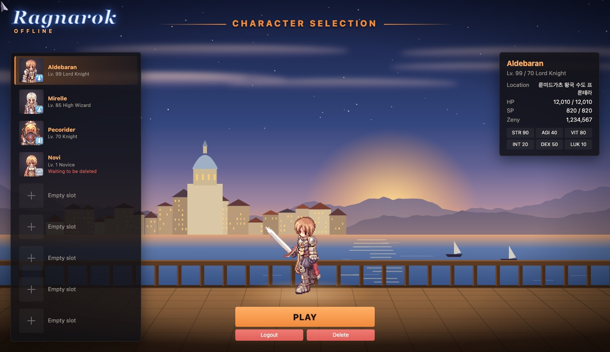

# pregame-stage

The screens before the game, drawn by a mod: a harbour at dusk seen from a
ship's deck, a login panel, a portrait list of your characters with the
selected one standing on the deck and a big **Play** button, and character
creation on the same stage. One layer, `client/`.

## What to look at first

`client/index.js`, and how little of it is about the game. Each screen is one
`api.screens.replace(screen, { show, update, hide })`: `show` fills
`view.root` with markup, and every button calls one of `view`'s actions —
`view.login(user, password)`, `view.select(slot)`, `view.play()`,
`view.create({ name, hair, hairColor, … })`. Those are the client's own
buttons, so logging in, entering the world, the delete countdown and every
error message work exactly as they do on the stock screens.

The characters are the client's: `api.screens.stage(canvas, { scale: 2 })`
draws a character's `look` — job, hair, colours, headgear, weapon, a mount —
on a canvas of the mod's. The portraits in the slot list are the same thing
cropped: `y: 1.9` puts the feet below a 56-pixel canvas, so only the head and
shoulders show.

Everything else is generated: `client/scene.js` draws the sky, the town, the
sea and the deck as an SVG from code, and `client/style.css` does the panels.
The only pictures taken from the game data are the job icons and the hair
colour swatches, through `api.screens.image()`. So the mod ships no artwork of
anyone's, and making it yours means changing `scene.js`.

## Settings

| | |
|---|---|
| Restyle the login screen | off leaves the client's own login window |
| Restyle character creation | off leaves the client's own creation window |

Character select is always restyled: it is the point of the example.

## What it does not do

- The **server list** is left to the client. This app logs straight into its
  one server, so the list never shows; a mod for a multi-server setup would
  replace `serverList` the same way.
- **Body colours at creation.** The server accepts a name, a job, a sex, a hair
  style and a hair colour when a character is made, and nothing else, so that
  is all this offers. Clothes are dyed at a stylist in game.
- **Pets.** The character list does not say which pet a character has.
  `stage.add({ job: 1002 }, { kind: 'monster', x: 0.7 })` would put a Poring
  beside the character, but it would be a Poring of the mod's choosing.

## Applying it

`client/` takes effect on an **app** restart, like every client-side layer.
