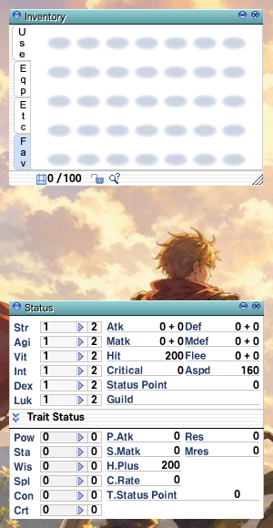

# ui-skin

Recolours the title bar of the windows that draw one — Inventory, Status and
the rest — teal. One layer, `data/`, three pictures, and one line of
`mod.json` that makes it a skin rather than any other mod:

```json
"kind": "skin"
```

That line is what makes it one of a set. Only one skin is on at a time:
switching this on in Settings → Mods switches whichever skin was on off, and
the other way round. Without it, two skins switched on together would each win
wherever the other had no picture, and the interface would be a patchwork of
both.



## What to look at first

The path. A skin is pictures under the client's interface folder,
`data/texture/유저인터페이스/`, which a mod may write as `data/texture/ui/`:

```
data/texture/ui/basic_interface/titlebar_left.bmp    12 × 17
data/texture/ui/basic_interface/titlebar_mid.bmp     12 × 17, repeated across
data/texture/ui/basic_interface/titlebar_right.bmp   12 × 17
```

Same names and the same sizes as the client's own: roBrowser lays its windows
out around them. Pure magenta (`#FF00FF`) is transparent, which is how the left
and right pieces round their corners.

These three were drawn by a few lines of code, not taken from anyone's skin, so
they are free to copy. They are 24-bit BMPs; the client's own are 8-bit, and
either works.

Not every window uses these three. The Skill Tree and Game Options windows draw
their title bars from other pictures, and the window bodies are drawn by
roBrowser's own CSS, which no picture can change.

## A real skin

You do not have to lay a skin out by hand. **Settings → Mods → Install a UI
skin…** takes an official-client skin — the folder you would put in the
client's `skin/` directory, or a zip of it — and builds this kind of mod from
it, placing each picture against your GRF's own list of names. See
[UI skins](../../../docs/MODDING.md#ui-skins).
